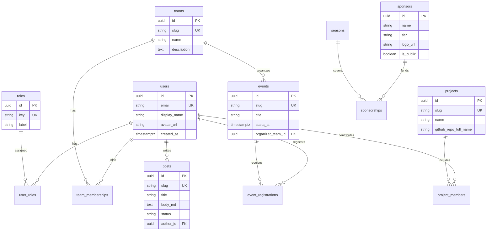

# Üniversite Yazılım Kulübü Platformu — Mimari & Ürün Spesifikasyonu

Bu doküman; Stanford ACM, Berkeley ACM, Harvard Computer Society ve MIT CSAIL çizgisinde **kurumsal, ölçeklenebilir ve yönetilebilir** bir kulüp platformu için hedef mimariyi tanımlar. Mevcut kod tabanı: **Turborepo + `apps/web` (Next.js 15)** ve **`server/` (Express + JWT + SQLite)** — üretimde PostgreSQL ve modüler API genişlemesi için yol haritası aşağıdadır.

---

## 1. Benchmark'tan çıkan UI/UX ilkeleri

| Referans | Öğrenilen desen | Uygulama |
|----------|-----------------|----------|
| **Stanford ACM** | Üst seviye menü, etkinlik/öğrenci odaklı net akış | Birincil nav: Kulüp → Etkinlikler → Projeler → Ekipler → İçerik → Partnerler; CTA sabit (üyelik / takvim) |
| **Berkeley ACM** | Alt topluluklar (SIG / committee) | "Odak alanları" veya **alt ekipler** (AI, Web, Siber Güvenlik, Mobil…) ayrı sayfa + lider iletişim |
| **Harvard CS** | Premium, sakin grid, güçlü tipografi | Geniş boşluk, sınırlı renk paleti, kaliteli font hiyerarşisi (display + body) |
| **MIT CSAIL** | Bilgi yoğunluğu + minimal görsel gürültü | İçerik (blog/teknik yazı) okunabilirliği: tipografi plugin, kod blokları, TOC |

**Mobil öncelik:** navigasyon drawer + "en çok kullanılan" 3 aksiyon (etkinlikler, projeler, üyelik) üstte; formlar tek sütun, dokunma hedefleri ≥ 44px.

---

## 2. Teknoloji yığını — öneri ve karşılaştırma

### 2.1 Önerilen ana hat (mevcut yapı ile uyumlu)

| Katman | Seçim | Gerekçe |
|--------|--------|---------|
| **Frontend** | **Next.js (App Router) + React + TypeScript** | SSR/SSG, iyi DX, ekosistem |
| **Backend** | **Node.js (Express veya NestJS)** | Frontend ile paylaşılan tipler, tek dil |
| **Veritabanı** | **PostgreSQL** | İlişkisel model, JSON alanlar, tam metin arama |
| **Auth** | **JWT (access + refresh)** + **OAuth2** | API-first |
| **Deploy** | **Vercel** (web) + **Railway** (API) + **Docker** (API + worker) | CDN + serverless edge |

### 2.2 Backend alternatifleri

| | **Node.js** | **Django** | **.NET (ASP.NET Core)** |
|---|------------|------------|-------------------------|
| **Artı** | Kulüp ekibinde JS yaygın; mevcut kod; WebSocket/SSE kolay | Admin panel, ORM, güvenlik pil paketi | Kurumsal performans, tip güvenliği |
| **Eksi** | Disiplinsiz büyüme riski | Python + Node iki ekosistem | Windows/Linux pipeline bilgisi gerekir |
| **Ne zaman** | Varsayılan, MVP → ölçek | Çok içerik/editor odaklı | Üniversite IT .NET standardı varsa |

**Sonuç:** Kısa ve orta vadede **Node + PostgreSQL**; içerik ekibi güçlenirse Django Admin veya headless CMS (Strapi/Sanity) **ayrı servis** olarak eklenebilir.

---

## 3. Mimari yaklaşım: modüler monolit vs mikroservis

### 3.1 Modüler monolit (önerilen başlangıç)

- Tek deploy birimi içinde **sınırı net modüller**: `auth`, `members`, `events`, `projects`, `teams`, `content`, `sponsors`.
- Ortak: veritabanı şeması + paylaşılan kütüphane (doğrulama, RBAC).
- **Artı:** düşük operasyonel yük, basit transaction'lar, hızlı özellik teslimi.

### 3.2 Mikroservis (ileride)

Aşağıdakiler **ayrı servis** düşünülebilir: bildirim (e-posta/push), dosya/medya, arama, raporlama/analitik.

**Geçiş tetikleyicileri:** farklı ölçek/SLA ihtiyacı, bağımsız ekip, yoğun arka plan işleri.

### 3.3 API-first

1. **OpenAPI 3.1** kaynak doğruluk.
2. Sürümleme: `/api/v1/...`; kırıcı değişiklikte v2.
3. İstemci: generated fetch client veya `packages/api-client` (monorepo).

---

## 4. Ölçeklenebilir monorepo klasör yapısı (hedef)

```
website/
├── apps/
│   └── web/                          # Next.js — public + üye alanı
│       └── src/
│           ├── app/
│           │   ├── (marketing)/      # Statik/hafif dinamik sayfalar
│           │   ├── (auth)/           # giriş, kayıt, şifre sıfırlama
│           │   ├── (dashboard)/      # /panel — üye + yönetim
│           │   └── api/              # Next.js Route Handlers
│           ├── components/
│           │   ├── ui/               # tasarım sistemi atomları
│           │   ├── layout/           # Navbar, Footer, Shell, DashboardShell
│           │   └── modules/          # domain bileşenleri (EventCard, ProjectShowcase)
│           ├── features/             # use-case odaklı (contact-form gibi)
│           ├── lib/                  # api client, auth helper, utils
│           └── content/              # statik içerik; sonra CMS/API
├── server/                           # API (Express → modüler router'lar)
│   ├── modules/
│   │   ├── auth/
│   │   ├── members/
│   │   ├── events/
│   │   ├── projects/
│   │   ├── teams/
│   │   ├── content/
│   │   └── sponsors/
│   ├── db/
│   │   ├── migrations/
│   │   └── seeds/
│   └── openapi.yaml
├── packages/                         # (opsiyonel)
│   ├── eslint-config/
│   ├── tsconfig/
│   └── api-types/                    # paylaşılan Zod/TS tipleri
├── docs/
│   └── KULUP_PLATFORM_MIMARI.md      # bu dosya
├── turbo.json
└── pnpm-workspace.yaml
```

---

## 5. Sayfa haritası (bilgi mimarisi / sitemap)

### 5.1 Kamu (marketing + keşif)

| Rota | Amaç |
|------|------|
| `/` | Kahraman mesajı, yaklaşan etkinlik, öne çıkan proje, partner şeridi |
| `/hakkimizda` | Misyon, tarihçe, değerler |
| `/etkinlikler` | Liste + filtre; `/etkinlikler/[slug]` detay, kayıt CTA |
| `/projeler` | Vitrin; `/projeler/[slug]` README özeti, GitHub link, ekip |
| `/ekip` | Yönetim |
| `/topluluk` | Alt ekipler (Berkeley modeli) |
| `/topluluk/[slug]` | AI, Web, Cyber, Data, Mobil alt sayfa |
| `/blog` | Teknik yazılar listesi |
| `/blog/[slug]` | Makale detay |
| `/sponsorlar` | Sponsor seviyeleri, logolar, iletişim |
| `/uyelik` | Başvuru formu |
| `/iletisim` | Form |
| `/gizlilik`, `/yonetmelik` | Yasal |

### 5.2 Üye Paneli

| Rota | Roller |
|------|--------|
| `/panel` | `member` — genel bakış |
| `/panel/profilim` | `member` — profil |
| `/panel/etkinliklerim` | `member` — kayıtlı etkinlikler |
| `/panel/ayarlar` | `member` — tercihler |

---

## 6. Zorunlu modüller — sistem özeti

### 6.1 Üye yönetimi
- Kayıt, profil, roller (`guest`, `member`, `lead`, `board`, `admin`).
- JWT + refresh rotation; oturum tablosu.

### 6.2 Etkinlik yönetimi
- `Event`, `EventRegistration`, `Attendance` (opsiyonel QR/check-in).

### 6.3 Proje yönetimi
- `Project` + `github_repo_full_name`; periyodik GitHub sync.

### 6.4 Topluluk / alt ekipler
- `Team` (AI, Web, Cyber…), `TeamMembership`, `TeamLead`.

### 6.5 İçerik sistemi
- `Post` (blog/teknik), `Tag`, `Author` (User ile ilişkili).

### 6.6 Sponsorluk & partner
- `Sponsor` (tier: Platinum/Gold…), `Sponsorship` (dönem), `Partner`.

---

## 7. Bileşen mimarisi (React)

```
components/
├── ui/                    # Atomlar: Button, Badge, Card, Input, Select, Tabs
├── layout/                # SiteChrome, Navbar, Footer, PageHeader, DashboardShell
├── modules/
│   ├── events/            # EventCard, EventCalendar, RegistrationButton
│   ├── projects/          # ProjectCard, GitHubStats, ContributorList
│   ├── teams/             # TeamGrid, TeamLeadCard
│   ├── sponsors/          # SponsorTier, LogoMarquee
│   └── content/           # PostList, ProseArticle (typography)
└── providers/             # Theme, AuthSession (client)
```

---

## 8. Veri modeli (ER diyagramı)



---

## 9. CI/CD önerisi

| Aşama | Araç | İçerik |
|-------|------|--------|
| **PR** | GitHub Actions | `pnpm install`, `turbo lint`, `turbo type-check`, `turbo build` |
| **Güvenlik** | Dependabot / npm audit | Haftalık |
| **Deploy web** | Vercel | `main` merge |
| **Deploy API** | Docker → Railway | `server` image |
| **DB** | Migration job | deploy öncesi `migrate` |

---

## 10. Güvenlik ve uyumluluk

- Rate limit, Helmet, CORS allowlist.
- RBAC her hassas endpoint'te; admin işlemleri audit log.
- KVKK: iletişim ve üyelik verileri için saklama süresi ve silme talebi süreci.

---

## 11. Yol haritası (fazlar)

1. **Faz 0:** Tasarım token'ları + bileşen sistemi + bilgi mimarisi ✅
2. **Faz 1:** PostgreSQL + migration; üye profili + etkinlik CRUD API
3. **Faz 2:** Kayıt + e-posta bildirimi; public takvim API'den
4. **Faz 3:** GitHub sync job; proje vitrin dinamik
5. **Faz 4:** Blog workflow; sponsor paneli

---

*Bu doküman, kulübün "sadece vitrin" aşamasından **operasyonel platform**a geçişi için tek referans mimari metin olarak kullanılmalıdır.*
